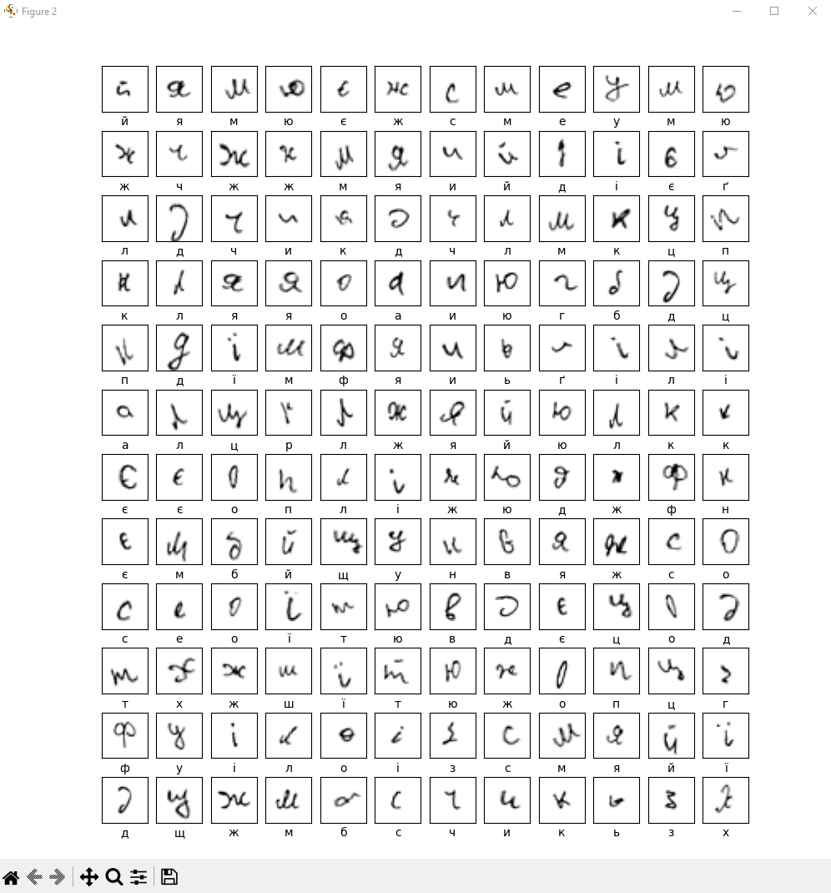
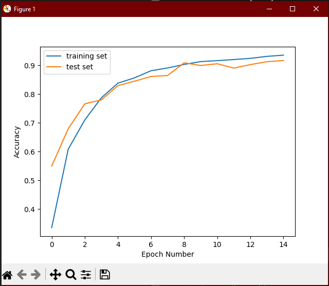
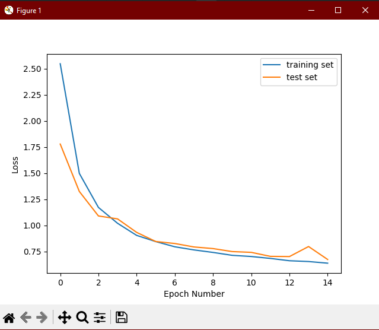
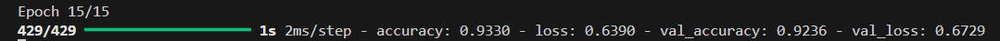
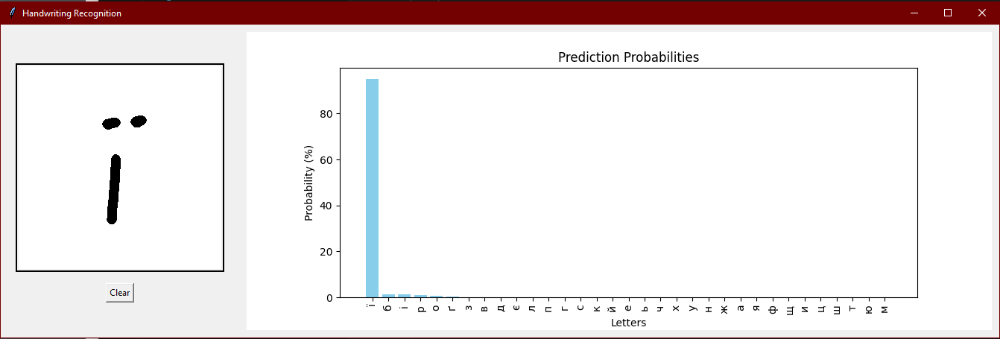
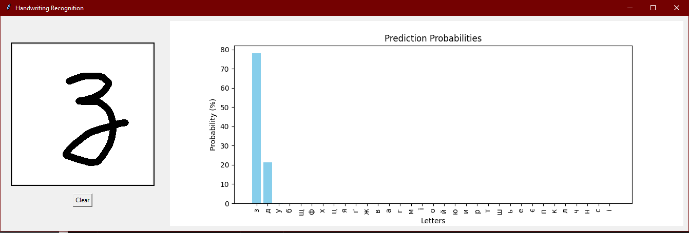
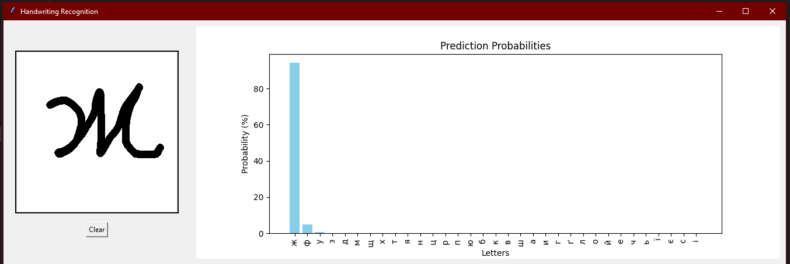

# Ukrainian Alphabet CNN Classifier

This project implements a Convolutional Neural Network (CNN) to recognize small letters in the Ukrainian alphabet. Using the raw dataset from [rukopys-dataset](https://github.com/lynnporu/rukopys-dataset), we sorted and augmented the data to improve the model's accuracy across all small letters.

## Augmentations
To make sure the model learns all the letters well, I focused only on lowercase letters, as the original dataset didn't cover everything. I used basic augmentations like **slight rotations and scaling** to give the model more varied examples, while keeping the letters readable.

I also added a feature in the GUI to save new symbols as they’re written.

## Training
The model uses a **Convolutional Neural Network (CNN)** designed to recognize the structure of Ukrainian letters. It starts by processing input images through a few convolutional layers to identify essential patterns. Next, it uses pooling layers to simplify what it learns from each layer. A final dense layer helps it classify each letter correctly. 

For training, I applied early stopping, so the model automatically halts training if validation loss stops improving, preventing overfitting. Additionally, I set up TensorBoard logging for tracking training progress and insights into model behavior.

## Testing
The model shows promising results considering the initial dataset started with only about 650 images, which I augmented to roughly 17,000. Through training, the model achieved over 90% accuracy by the 15th epoch, with a validation accuracy close behind, proving effective despite a limited starting dataset. Although the error rate still leaves much to be desired, all due to the size of the dataframe and the compulsory overtraining of the model. 

### Some examples of work:

